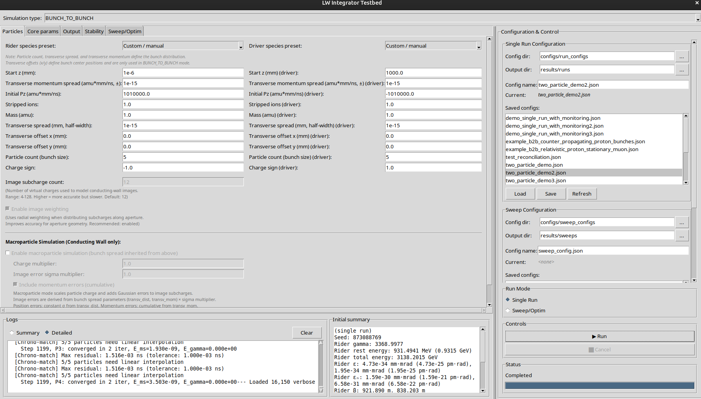
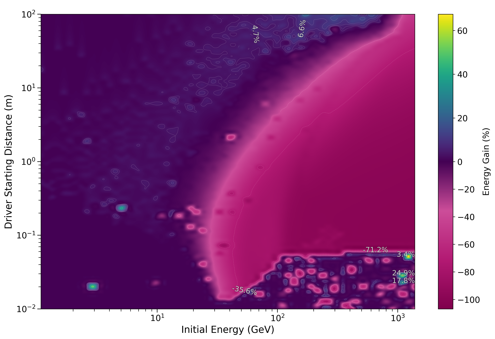
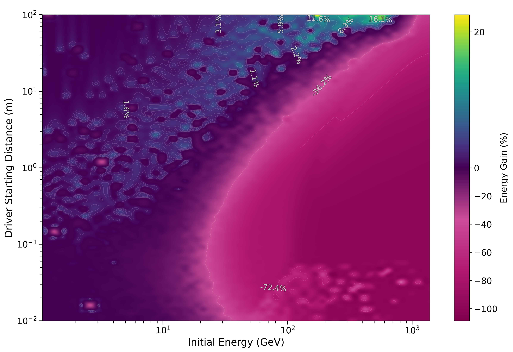
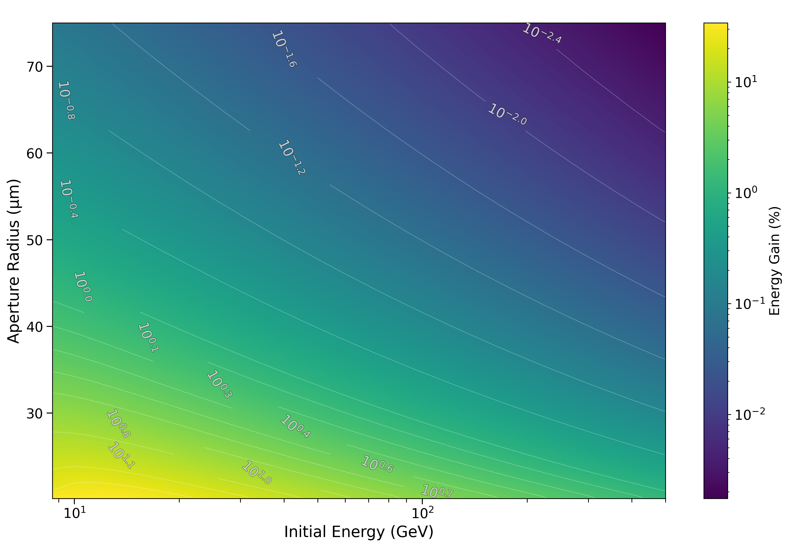
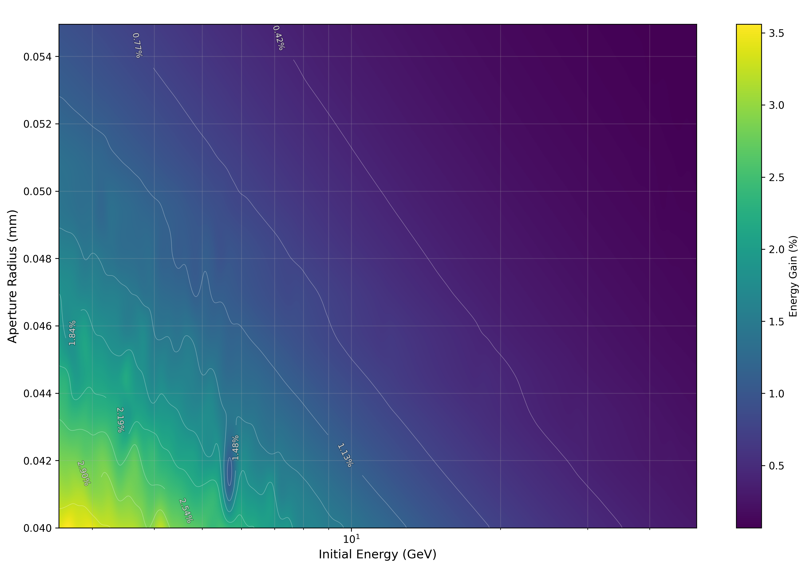

# LW Integrator

## Recent Updates (v0.6.0 — March 2026)

- **CLI/GUI parity** — the CLI sweep runner now calls the same core code paths
  as the GUI (`run_testbed()`, `SimulationOptions`), eliminating divergent
  behaviour between the two entry points.
- **Incomplete-sweep archiving** — sweeps with fewer than 100 completed runs
  are automatically relocated to `results/archive/incomplete/` on save
  (CLI, GUI, and library API).
- **Heatmap contour improvements** — reduced contour-line alpha, added
  edge-aware label clamping, and overlap culling so contour labels no longer
  clip at plot boundaries or stack on top of each other.
- **Driver energy sweep fix** — `driver_energy_gev` is now correctly converted
  to starting Pz in all sweep paths, fixing a bug where driver energy sweeps
  had no effect on BUNCH_TO_BUNCH simulations.

For the full history see [CHANGELOG.md](CHANGELOG.md).

---

The LW Integrator is a covariant charged-particle tracking code that evaluates
retarded Liénard–Wiechert potentials to obtain first-principles beam dynamics.
The repository contains a modernised `core` implementation that mirrors the
validated legacy solver, an updated Sphinx documentation set, and a collection
of validation scripts and notebooks. The methodology is documented in the
peer-reviewed article _Relativistic beam loading, recoil-reduction, and
residual-wake acceleration with a covariant retarded-potential integrator_
([Nucl. Instrum. Methods Phys. Res. A 1069 (2024) 169988](https://doi.org/10.1016/j.nima.2024.169988),
[arXiv:2310.03850](https://arxiv.org/abs/2310.03850)).

**Documentation:** [lw-integrator.readthedocs.io/en/latest](https://lw-integrator.readthedocs.io/en/latest)

---



---

## Contents

1. [Project overview](#project-overview)
2. [Repository layout](#repository-layout)
3. [Environment setup](#environment-setup)
4. [Running simulations](#running-simulations)

---

## Project overview

- **Physics focus.** The code integrates particle trajectories using
  retarded-vector potentials and conjugate-momentum dynamics. The `core`
  package is a faithful transcription of the proven legacy solver and is kept in
  numerical lockstep by an integration test suite.
- **Self-consistency and energy conservation.** The integrator enforces the
  relativistic mass-shell constraint Pt² = P² + (mc)² through iterative
  projection during each timestep. Two modes are available:
  - **mass_shell_only (default)**: Fast iteration with fixed geometry—retarded
    distances computed once per step. Suitable for most simulations.
  - **full_iteration**: Updates particle positions and recomputes retarded
    distances each iteration for maximum accuracy when particles move
    significantly (|Δx| ~ 0.1×R_separation). Computationally expensive but
    accounts for geometric changes during the timestep.
    Self-consistency is enabled by default and critical for energy conservation
    in high-energy simulations (γ > 10⁴). Implemented December 2025.
- **Gamma reconciliation.** The integrator computes the Lorentz factor γ in two
  ways: from conjugate momentum (γ_energy) and from velocity (γ_velocity).
  Numerical differences between these can cause energy jumps. Five reconciliation
  methods are available via `GammaReconciliationMethod`:
  - **ADAPTIVE_WEIGHTED (default)**: Velocity-dependent blending with configurable
    thresholds and weights. Trusts energy at low β, velocity at high β.
  - **FIXED_WEIGHTED**: Fixed 50/50 blend (or custom weight).
  - **USE_VELOCITY** / **USE_ENERGY**: Use one calculation exclusively.
  - **DISABLED**: No reconciliation (legacy, not recommended).
    Configurable via API (`self_consistency_gamma_reconciliation_method` and related
    parameters) and GUI (Stability → Self-Consistency → Gamma Reconciliation).
    See `local/gamma_reconciliation_config.md` for detailed usage.
- **Adaptive timestep and beta clamping.** The integrator includes numerical
  safety features for extreme relativistic regimes (γ > 10⁶):
  - **Beta clamping** prevents particle velocities from reaching the speed of
    light (β ≥ 1), ensuring the Lorentz factor remains finite even at extreme
    energies. Velocities are automatically limited to β < 0.99999999999999999
    (17 decimal places, near the float64 precision limit) corresponding to
    ~34 TeV for electrons.
  - **Adaptive timestep refinement** detects energy jumps during integration
    and automatically retries problematic steps with smaller timesteps. This
    is configurable via `AdaptiveTimestepConfig` and particularly useful for
    high-energy electron-wall simulations.
- **Trajectory stability analysis.** Post-integration validation assesses
  whether trajectories are numerically stable across multiple timesteps, even
  in regions with strong physical forces (radiation reaction, image charges).
  Rather than rejecting runs with large single-step jumps—which can represent
  valid physics—the analyzer checks for oscillatory instabilities, erratic
  evolution that cannot fit smooth polynomial trends, and multi-scale
  inconsistencies. This multi-step approach distinguishes numerical artifacts
  from physical behavior and is essential for unattended sweep and optimization
  runs. Configured via `SmoothnessConfig` with presets for strict,
  balanced, and permissive validation. See `core/smoothness_analyzer.py`
  and `local/smoothness_checking_implementation.md` for details.
- **Macroparticle simulation.** For conducting-wall simulations, the integrator
  supports macroparticle mode where test particle charges are scaled by a
  configurable multiplier and image subcharge positions receive stochastic errors
  based on transverse position and momentum spreads. Position spread applies
  constant Gaussian errors (σ_x), while momentum spread creates cumulative
  displacement that grows with each timestep: σ_total(step) = sqrt(σ_x² +
  (σ_p × h × step / m)²). These errors are applied before charge attenuation
  calculations to accurately model beam emittance effects. Configured via GUI
  controls in the Particles tab (single runs) and optimization/sweep parameter
  sections. Only active for CONDUCTING_WALL simulation type.
- **GUI and CLI entry points.** The GUI (`python -m lw_integrator.gui`) provides
  an interactive interface for single runs, parameter sweeps, and optimization,
  with real-time logging and an initial-state summary panel. The `lw-simulate`
  console command (see [Command-line entry point](#command-line-entry-point)
  below) runs the same core code paths with JSON-configurable inputs. A minimal
  CLI demonstration lives in `examples/entrypoint_demo.py`.

---

## Repository layout

```
LW_integrator/
├── core/                 # Maintained integrator implementation and helpers
├── configs/              # JSON run and sweep configuration files
├── docs/                 # Sphinx configuration, sources, and build script
├── examples/
│   └── validation/       # CLI and notebook-based comparison studies
├── input_output/         # Particle bunch initialisation utilities
├── legacy/               # Archived original solver and notebooks
│                         # (deprecated — kept for regression comparisons)
├── lw_integrator/        # CLI, GUI, sweep runner, and testbed runner
├── optimization/         # Sweep/optimization engine, metrics, result I/O
├── results/              # Sweep and optimization output (git-ignored)
├── scripts/              # Monitoring and helper scripts
├── tests/                # Pytest suite covering physics and helper modules
├── .github/workflows/    # Continuous-integration pipelines (docs publishing)
├── core/_version.py      # Single source of truth for the project version
└── README.md             # You are here
```

---

## Environment setup

### System Dependencies

Before installing Python packages, ensure you have the required system dependencies:

**Ubuntu/Debian:**

```bash
sudo apt-get update
sudo apt-get install python3-tk python3-dev
```

**Fedora/RHEL:**

```bash
sudo dnf install python3-tkinter python3-devel
```

**macOS:**

```bash
# Tkinter is included with Python from python.org
# If using Homebrew Python:
brew install python-tk@3.11  # adjust version as needed
```

**Windows:**

```powershell
# Tkinter is included with standard Python installers from python.org
# No additional installation needed
```

> **Note:** The GUI components require Tkinter, which is **not** pip-installable and must be installed at the system level. If you see `ModuleNotFoundError: No module named 'tkinter'`, install the appropriate system package above.

### Python Environment

1. **Create and activate a virtual environment** (Python 3.8–3.13 are supported).

   ```bash
   python -m venv .venv
   source .venv/bin/activate  # On Windows: .venv\Scripts\activate
   ```

2. **Install the package in editable mode** with commonly used extras.

   **For general usage (simulation + GUI):**

   ```bash
   pip install -e .
   ```

   **For development (includes testing/linting tools and bump2version):**

   ```bash
   pip install -e ".[dev]"
   ```

   **For full installation (dev + examples + documentation):**

   ```bash
   pip install -e ".[dev,examples,docs]"
   ```

   - `dev` adds pytest, black, flake8, mypy, and bump2version for development
   - `examples` installs Jupyter and ipywidgets for interactive notebooks
   - `docs` brings in Sphinx, `sphinx-autobuild`, and related extensions

3. **(Optional) register the kernel for Jupyter usage.**

   ```bash
   python -m ipykernel install --user --name lw-integrator --display-name "LW Integrator (.venv)"
   ```

### Troubleshooting

**Matplotlib backend issues:**

If you encounter matplotlib GUI errors, try setting a different backend:

```bash
export MPLBACKEND=TkAgg  # Linux/macOS
set MPLBACKEND=TkAgg     # Windows CMD
```

Or configure it in your script:

```python
import matplotlib
matplotlib.use('TkAgg')
import matplotlib.pyplot as plt
```

**Version management (developers only):**

The `bump2version` tool is included in the `dev` extras. If you only installed the base package (`pip install -e .`), you'll need to install dev dependencies to use versioning tools:

```bash
pip install -e ".[dev]"
```

---

## Running simulations

### GUI Application

The project includes a Tkinter-based GUI for single runs, parameter sweeps, and optimization:

```bash
python -m lw_integrator.gui
```

> **Note:** The GUI and CLI now share the same core integration code paths
> (`run_testbed()` / `SimulationOptions`), so results are identical regardless
> of which interface you use.

The GUI provides three operational modes:

**Single Run Mode** (Main tab):

- Configure and run individual simulations with real-time progress tracking
- Full control over particle properties, boundary conditions, and physics parameters
- Interactive trajectory visualization and energy/position analysis
- Export results in multiple formats (CSV, JSON, NPZ)
- Self-consistency iteration controls for high-gamma physics

**Sweep / Optimization Modes** (Sweep/Optimization tab):

#### Blind Sweep Mode

- **Parameter sweeps** over aperture radius, particle energy, transverse offset, and starting positions
- **Sweepable fixed parameters** - mass, charge, transverse momentum, timestep, wall position
- **Auto-timestep calculation** to maintain consistent integration resolution across energy ranges
- **Trajectory saving** with configurable stride
- Results saved to timestamped directories with JSON summary and plots

#### Optimization Mode

- **Multiple algorithms**: Genetic Algorithm, Differential Evolution, Nelder-Mead, Multi-start
- **Convergence detection**: Early stopping when fitness plateaus (GA only, configurable tolerance and patience)
- **Objectives**: Maximize energy gain (%), minimize transverse deflection, or custom metrics
- **Real-time logging**: Progress tracking with generation/iteration updates
- **Top-N saving**: Automatically saves best configurations found

**Optimization Quick Start:**

1. Select "Optimization" mode
2. Choose optimizer (Genetic Algorithm recommended for global search)
3. Set convergence parameters:
   - Tolerance: 1e-6 (relative improvement threshold)
   - Patience: 10 generations (lookback window)
4. Define parameter ranges (at least 2 sweep dimensions required)
5. Run - optimizer automatically stops when converged or max iterations reached

**Performance Notes:**

- Early stopping can reduce runtime by 40-70% when convergence occurs
- For radiation reaction physics (stripped_ions > 10), use timestep ≤ 3e-7 ns with self-consistency enabled
- Nelder-Mead is fastest for local optimization (~15-50 min), GA/DE are thorough but slower (~1-3 hours)

Results are saved to `results/sweeps/YYYYMMDD_HHMMSS_configname/` with convergence history, best parameters, and optional trajectory data. See `local/SWEEP_AND_OPTIMIZATION_GUIDE.md` for detailed usage.

### Command-line entry point

Installing the project (`pip install -e .` or via a wheel) exposes the
`lw-simulate` executable. The CLI uses sensible defaults (35 MeV electron
approaching a conducting aperture) but accepts both inline parameter overrides
and JSON configuration files.

**Basic usage with defaults:**

```bash
lw-simulate --quiet
```

**Override specific parameters:**

```bash
lw-simulate --steps 250 --time-step 5e-4 --aperture-radius 0.5 --output run.json
```

**Use a configuration file:**

```bash
lw-simulate --config my_scenario.json --output results.json
```

**Run a parameter sweep from a sweep configuration:**

```bash
lw-simulate --sweep-config configs/sweep_configs/example_b2b_linked_energy_vs_driver_distance.json
```

The sweep runner writes results to `results/sweeps/YYYYMMDD_HHMMSS_configname/`
and detailed debug logs to `logcache/`. Sweeps with fewer than 100 completed
runs are automatically relocated to `results/archive/incomplete/`.

The JSON configuration file allows complete specification of simulation
parameters, particle bunches, and physics options. Example structure:

```json
{
  "simulation": {
    "steps": 1000,
    "time_step": 3e-7,
    "simulation_type": "conducting-wall",
    "aperture_radius": 0.01,
    "wall_position": 100.0
  },
  "rider": {
    "mass": 1.0,
    "charge": 1.0,
    "energy": 5.0,
    "x0": 0.0,
    "y0": 0.0,
    "z0": 0.0
  }
}
```

Additional CLI options include:

- `--chrono-mode`: Retardation sampling strategy (`averaged` or `fast`)
- `--startup-mode`: Early-step handling (`cold-start` or `approximate-back-history`)
- `--image-weighting` / `--no-image-weighting`: Control image charge distribution
- `--self-consistency`: Enable self-consistency iterations for ultra-relativistic particles
- `--sweep-config`: Path to a JSON sweep configuration (runs a full parameter sweep)
- `--log-verbosity`: Override sweep log verbosity (`none`, `truncated`, or `full`)
- `--sc-verbosity`: Override self-consistency verbosity (0–3)
- `--adaptive-debug` / `--no-adaptive-debug`: Toggle adaptive timestep debug output

Run `lw-simulate --help` for complete option listing.

Conducting-wall runs apply radial weighting to image subcharges by default for
better agreement with the aperture geometry. Pass `--no-image-weighting` to
recover the legacy uniform distribution when benchmarking or debugging.

Programmatic usage mirrors the console invocation: call
`lw_integrator.cli.main` with a list of CLI-style arguments. See
`examples/entrypoint_demo.py` for a ready-to-run demonstration that exercises
both patterns.

### Sweep heatmap generation

After a sweep completes you can generate publication-quality heatmaps with
`lw-generate-sweep-heatmap` or the compatibility script
`generate_sweep_heatmap.py`:

```bash
lw-generate-sweep-heatmap results/sweeps/<sweep_dir> \
    --no-title --output gains.png --absolute-gains --log-param2 \
    --energy-max 1000 --num-contours 8 --no-markers --grey-zero \
    --grey-centre 0 --gain-max 200 --energy-min 1 --log-colorbar
```

Contour lines use reduced alpha (0.18) and labels are automatically clamped
to stay within the axes. Overlapping labels are culled after the final
layout pass so they never stack on top of each other.

---

## Example configurations

Simple example configs live under `configs/`. Load them via the GUI
(**Configuration & Control → Load**) or pass them directly to the CLI.

### Single-run examples (`configs/run_configs/`)

| File                                                       | Description                                                                                                                                                                                                                           |
| ---------------------------------------------------------- | ------------------------------------------------------------------------------------------------------------------------------------------------------------------------------------------------------------------------------------- |
| `example_b2b_counter_propagating_proton_bunches.json`      | Two counter-propagating proton bunches (5+5 particles, 300 M stripped ions each), cold start. Demonstrates bunch-to-bunch energy exchange at non-relativistic energies.                                                               |
| `example_b2b_relativistic_proton_stationary_lead_ion.json` | Ultra-relativistic proton rider (Pz = 1,010,000 amu·mm/ns, γ ≈ 3369) approaching a stationary lead ion driver (1 T stripped ions, m = 207.2 amu). Uses `APPROXIMATE_BACK_HISTORY` startup for accurate retarded-field initialisation. |

### Sweep examples (`configs/sweep_configs/`)

**`example_b2b_linked_energy_vs_driver_distance.json`** — 80×80 log-spaced sweep of initial energy (0.5–3000 GeV) vs driver starting distance (10–100,000 mm) for counter-propagating proton bunches with linked rider/driver energy. Rider and driver each have 1 µm transverse spot size.



---

**`example_b2b_linked_energy_vs_driver_distance_35um_rider.json`** — Same sweep geometry but with an asymmetric spot size: rider 35 µm, driver 0.1 µm. The larger rider spot reduces near-collision blowups.



---

**`example_conducting_wall_electron_aperture_sweep.json`** — 50×50 log-spaced sweep of initial energy (1–500 GeV) vs aperture radius (15–75 µm) for a single electron rider approaching a conducting wall. Rider transverse spot size 1 µm. Macroparticle mode enabled (charge multiplier ×1000, sigma multiplier ×2).



---

**`example_conducting_wall_electron_aperture_sweep_10um_spotsize.json`** — 100×100 log-spaced sweep of initial energy (1.8–90 GeV) vs aperture radius (40–550 µm) for a single electron rider with 10 µm transverse spot size approaching a conducting wall. Macroparticle mode enabled.


